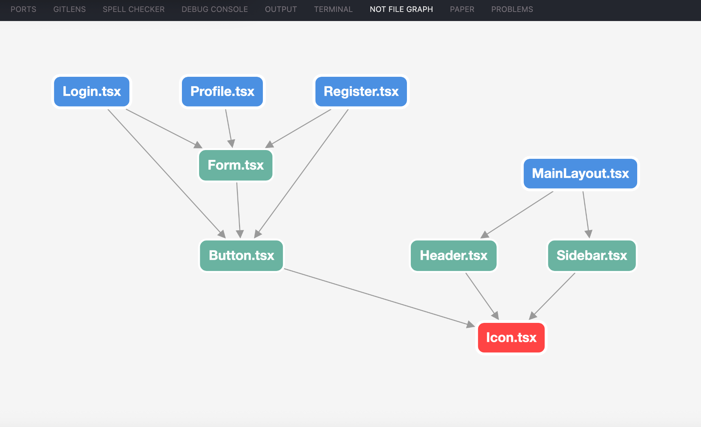

# Not File Graph

Расширение для VS Code, которое визуализирует зависимости между файлами в проекте.



## Возможности

- Визуализация зависимостей между JavaScript/TypeScript файлами в виде графа
- Подсветка корневых узлов (файлов без зависимостей) синим цветом
- Подсветка выбранного файла красным цветом
- Возможность открыть файл по клику на узел графа
- Автоматическое центрирование графа на выбранном файле

## Команды

- `Not File Graph: Select File` - открыть диалог выбора файла для построения графа
- `Not File Graph: Show Current File Graph` - построить граф для текущего активного файла

Для построения графа необходимо прописать путь к файлу в котором прописаны зависимости
Путь задается в настройке `not-file-graph.sourceFilePath`
Файл должен иметь формат `.json` вида:

```json
{
    "file1.ts": {
        "importsDeclarations": ["file2.ts", "file3.ts"],
        "reverseImports": []
    },
    "file2.ts": {
        "importsDeclarations": ["file2.ts"],
        "reverseImports": ["file1.ts"]
    },
    "fil3.ts": {
        "importsDeclarations": [],
        "reverseImports": ["file1.ts", "file2.ts"]
    }
}
```

## Контекстное меню

В контекстном меню файлов JavaScript/TypeScript (правый клик на файле) доступна команда:
- `Not File Graph: Select File` - построить граф для выбранного файла

## Требования

- VS Code версии 1.99.0 или выше
- JavaScript/TypeScript проект

## Лицензия

MIT
